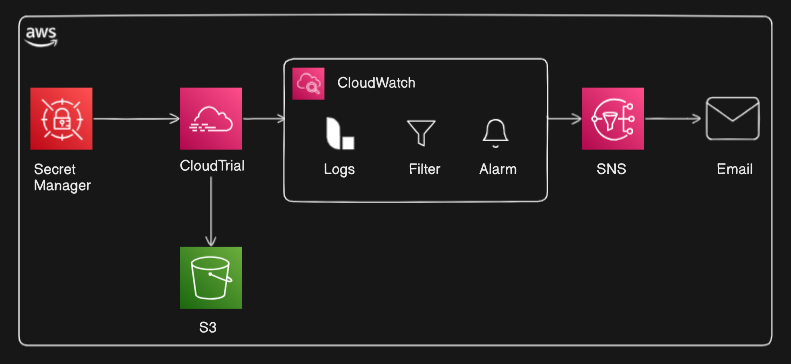
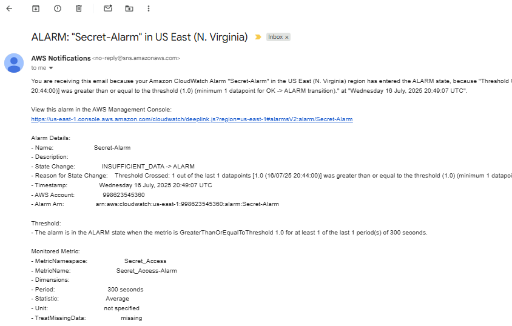

# security-monitoring-system

## Overview
This project demonstrates how to build a **Security Monitoring System** on AWS that detects suspicious activities and sends real-time alerts to administrators. The system uses **CloudTrail, CloudWatch, SNS, and Secrets Manager** to automate security monitoring in a scalable and secure way.

---

## 🧰 Services Used
- **AWS CloudTrail**: Records and logs all users activities in the AWS account.
- **AWS CloudWatch**: Creates metric filters and alarms based on specific CloudTrail events.
- **AWS Secrets Manager**: Securely stores sensitive credentials like API keys or DB passwords and Tokens.
- **Amazon SNS**: Sends notifications (email/SMS) when an alarm is triggered.

---

## 🏗️ Architecture Diagram

---

## Key Use Cases
- Alert when sensitive data or secret are accessed.
- Notify when root login occurs
- Monitor failed login attempts
- Detect creation or deletion of security groups

---

## 🚀 How It Works
1. **CloudTrail** records all user/API activity.
2. **CloudWatch Logs** Creates metric filters and alarms based on specific CloudTrail secret access events.
3. **Metric filters** are created to detect specific patterns (e.g., `ConsoleLogin`, `DeleteSecurityGroup` `secret`, etc.).
4. **Alarms** are triggered when a filter condition is met.
5. **SNS topic** sends an alert to a subscribed email or SMS.
6. **Secrets Manager** ensures secure storage of any sensitive credentials required for integrations.

## 📧 Example Alert

Threshold:
- The alarm is in the ALARM state when the metric is GreaterThanOrEqualToThreshold 1.0 for at least 1 of the last 1 period(s) of 300 seconds.

Monitored Metric:
- MetricNamespace:                     Secret_Access
- MetricName:                          Secret_Access-Alarm
- Dimensions:                         
- Period:                              300 seconds
- Statistic:                           Average
- Unit:                                not specified
- TreatMissingData:                    missing

